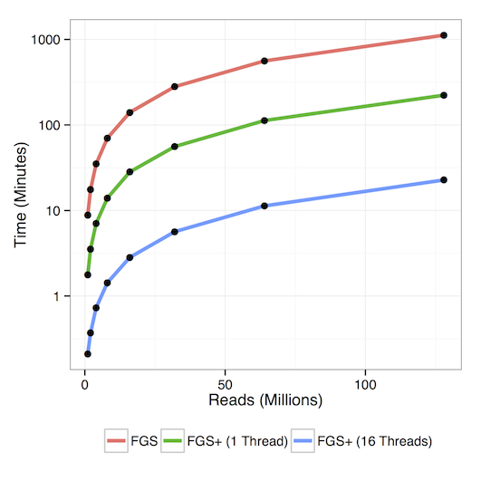

# FragGeneScan+ Results

Performance results for FragGeneScan+ experiments. See <fgsp_results.md>.

* <data/>: directory containing FGS+ runtime data
* <imgs/>: directory for resulting image files
* <fgsp_results.Rmd>, <fgsp_results.md>, <fgsp_results.html>: Analysis code and compiled resulting files