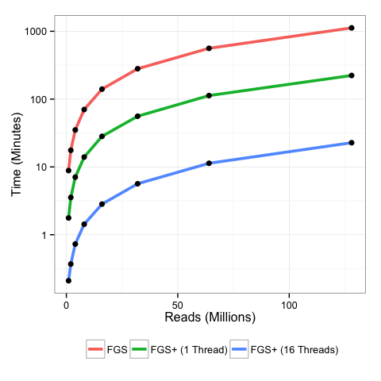
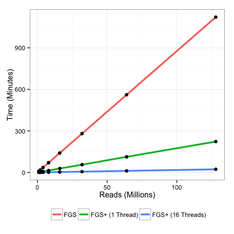

# FragGeneScan+ Results
Dongjae Kim, Aria S. Hahn, Shang-Ju Wu, Niels W. Hanson, Kishori M. Konwar, Steven J. Hallam  
March 18, 2015  

This document summarizes the performance evaluation of FragGeneScan+, a multithreaded implementation of the [FragGeneScan](http://omics.informatics.indiana.edu/FragGeneScan/) fragmented open reading frame (ORF) finding software. Full details can be found in the manuscript:

* Dongjae Kim, Aria S. Hahn, Shang-Ju Wu, Niels W. Hanson, Kishori M. Konwar, Steven J. Hallam. FragGeneScan+: high-throughput short-read gene prediction, Proceedings of the 2015 IEEE Conference on Computational Intelligence in Bioinformatics and Computational Biology (CIBCB 2015), Niagara Falls, Canada, August 12-15, 2015.

# Contents

This document references the following data files:

* [data/](data/data/FGS+Results.csv): Data for FGS+ runtmies

Raw sequence data used in the performance simulations can be found [here](https://www.dropbox.com/sh/5brhvcg0mi7uwor/AACL2RNWEgHsYtRhjccDHd4Qa?dl=0)

# Preamble

* Load required packages


```r
library(ggplot2)
library(reshape2)
```

# FragGeneScan+ Performance

* Modify and clean data set


```r
df <- read.table("data/FGS+Results.csv", header=T, sep=",")
names(df) <- c("reads_millions", "FGS", "FGS+ (1 Thread)", "FGS+ (16 Threads)")
df.m <- melt(df, id.var=("reads_millions"), variable.name="Algorithm", value.name = "time_min")
df.m$Algorithm <- factor(df.m$Algorithm, levels=c("FGS", "FGS+ (1 Thread)", "FGS+ (16 Threads)"))
```

* Plot completion time vs. number of sequences


```r
p1 <- ggplot(df.m, aes(x=reads_millions, y=time_min, group=Algorithm)) 
p1 <- p1 + geom_line(aes(color=Algorithm), size=1.3) 
p1 <- p1 + geom_point(size = 2.5) 
p1 <- p1 + scale_y_log10(breaks=c(1,10,100,1000))
p1 <- p1 + xlab("Reads (Millions)")
p1 <- p1 + ylab("Time (Minutes)")
p1 <- p1 + theme_bw()
p1 <- p1 + theme(legend.position="bottom", legend.title=element_blank())
p1 <- p1 + scale_fill_discrete( labels=c("Control", "Treatment 1", "Treatment 2"))
p1
```

 


```
## quartz_off_screen 
##                 2
```

* Do it again except without $log_{10}$


```r
p2 <- ggplot(df.m, aes(x=reads_millions, y=time_min, group=Algorithm)) 
p2 <- p2 + geom_line(aes(color=Algorithm), size=1.3) 
p2 <- p2 + geom_point(size = 2.5) 
p2 <- p2 + xlab("Reads (Millions)")
p2 <- p2 + ylab("Time (Minutes)")
p2 <- p2 + theme_bw()
p2 <- p2 + theme(legend.position="bottom", legend.title=element_blank())
p2 <- p2 + scale_fill_discrete( labels=c("Control", "Treatment 1", "Treatment 2"))
p2
```

 


```
## quartz_off_screen 
##                 2
```

* Calcualte speedups


```r
avg_fgsp_fgs_speedup <- round(mean(df$FGS / df$`FGS+ (1 Thread)`),1)
avg_fgsp_thread_speedup <- round(mean(df$`FGS+ (1 Thread)` / df$`FGS+ (16 Threads)`),1)
avg_fgsp_fgs_threaded_speedup <- round(mean(df$FGS / df$`FGS+ (16 Threads)`),1)
```

* The overall improvement thread implementation of FragGeneScan+ is 48.1 times faster than its original implementation.
    * Combination of improvements in serial implementation and parallel algorithimic thread synonization
* The average emperical speed up of FGS+ vs FGS is 5
    * Attributed to better system calls, better memory management, calculating global model parameters up-front, and improved code logic
* The average emperical speed up of FGS+ (Single thread) vs. FGS+ (16 Threads) is 9.6 
    * Directly attributable to the algorithmic thread synonization
